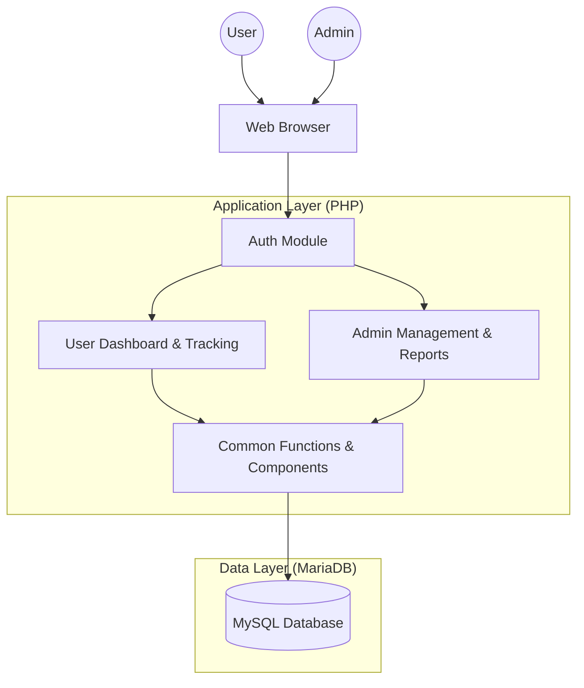

# Project Overview: Ziyafat us Shukr (ZS1449)

## Purpose
Ziyafat us Shukr is a spiritual and financial tracking application designed for a specific community (Dawoodi Bohra, based on terminology like "ITS", "Amali", "Juz", "Dua"). It allows users to track their spiritual progress (Quran reading, Dua counting, Book transcription) and their financial contributions towards specific targets.

## Domain Logic
- **Amali tracking:** Users log their daily spiritual activities across three main categories: Quran, Dua, and Book transcription.
- **Financial distribution:** Contributions are distributed using a "waterfall" logic, where payments fill consecutive targets (Tasea, Ashera, Hadi Ashara) sequentially based on cumulative INR amounts.
- **Role-based access:** Different admin levels (Super, Finance, Amali, Category-specific) have access to different sets of data and management features.

## Main Features
### User Module
- **Dashboard:** Overview of spiritual and financial progress.
- **Quran Tracking:** Log completion of Juz across multiple Qurans.
- **Dua Tracking:** Record counts for various duas from a master list.
- **Book Transcription:** Select books and track page-by-page progress.
- **Financial Report:** View contributions and their distribution across target years.
- **Profile Management:** Basic user profile view.

### Admin Module
- **User Management:** Add, edit, delete, and view user details and ITS numbers.
- **Contribution Management:** Add, edit, delete financial records.
- **Content Management:** Manage the master list of books and duas.
- **Reports:** Comprehensive reports for Amali progress and financial status across different categories (Surat, Marol, Karachi, Nairobi, Muntasib).

## System Diagram

## Feature List by Module
### Authentication
- ITS Number & Password Login
- Session-based persistence
- Role-based redirection

### Amali (Spiritual)
- **Quran:** Progress tracking by Juz (120 total Juz target).
- **Dua:** Activity log with count tracking against targets.
- **Book:** Transcription progress with page counts and status (selected/completed).

### Finance
- **Contributions:** Tracking in USD and INR.
- **Waterfall Logic:** Automatic distribution of funds across targets (66k, 97k, 127k).

### Admin
- **User Admin:** Full CRUD on users and roles.
- **Amali Reports:** Aggregated progress reports by category.
- **Finance Reports:** Category-wise financial summaries.
